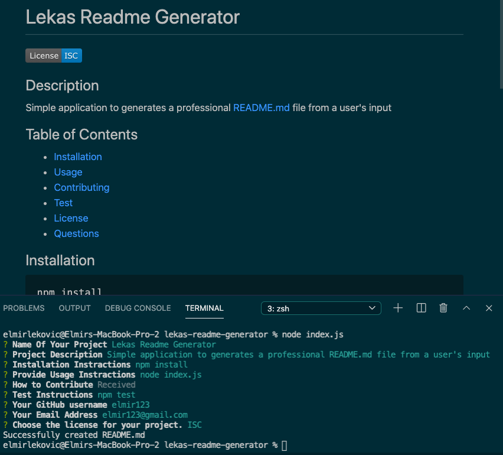

# Lekas Readme Generator

[](https://opensource.org/licenses/isc)
  
## Description
Simple application to generates a professional README.md file from a user's input
  
## Table of Contents
- [Installation](#installation)
- [Usage](#usage)
- [Contributing](#contributing)
- [Test](#test)
- [License](#license)
- [Questions](#questions)
  
## Installation
```md
npm install
```
  
## Usage
```md
node index.js
```
  
## Contributing

If you have ideas that you would like to contribute please:
- Fork the project integrate your ideas 
- Contact me with the link to your project


  
## Test
```md
npm test
```

## License
[](https://opensource.org/licenses/isc)
  
## Questions
Please contact me through GitHub:
GitHub Profile https://github.com/elmir123
  
Or using my email addres:
Email: elmir123@gmail.com

## Demos
The following image demonstrates the application's appearance:


To view the Demo Video use this link:
